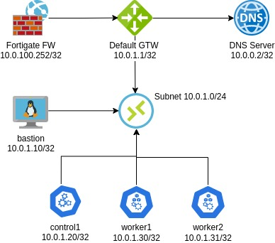
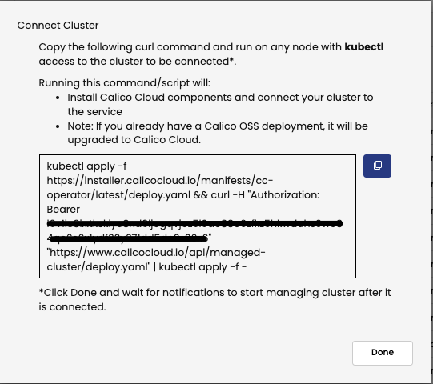
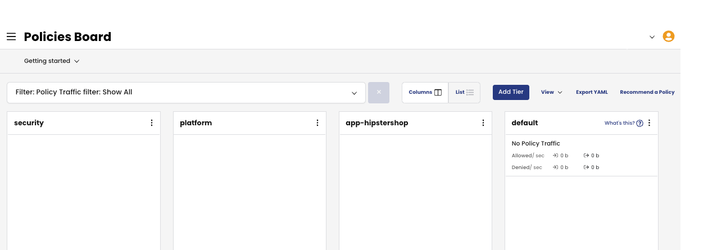

# Module 1 - Overview of the Calico Cloud Security Policy capabilities 

## 1. The lab architecture is explained in this topic


<p align="center">
  
</p>

Hosts/nodes:

*  10.0.0.2/32: DNS Server for the subnet 10.0.1.0/24
*  10.0.1.1/32: Default gateway for the subnet 10.0.1.0/24
*  10.0.1.10/32: Bastion Host - Linux server that plays the roles of BGP ToR and Jump server
*  10.0.1.20/32: Kubernetes Master node (Control1) 
*  10.0.1.30/32: Kubernetes Worker node (Worker1)
*  10.0.1.31/32: Kubernetes Worker node (Worker2)

## 2. Install Calico as CNI

The nodes are in Not Ready status so it means there is no CNI configured.

```bash
kubectl get nodes
```
```bash
NAME                                         STATUS     ROLES                  AGE   VERSION
ip-10-0-1-20.ca-central-1.compute.internal   NotReady   control-plane,master   49m   v1.22.4
ip-10-0-1-30.ca-central-1.compute.internal   NotReady   worker                 49m   v1.22.4
ip-10-0-1-31.ca-central-1.compute.internal   NotReady   worker                 49m   v1.22.4
```

### a. Install the Calico Operator

```bash
kubectl apply -f https://projectcalico.docs.tigera.io/archive/v3.22/manifests/tigera-operator.yaml
```

### b. Verify if the Calico Operator has successfully deployed:

```bash
kubectl rollout status -n tigera-operator deployment tigera-operator
```
```bash
deployment "tigera-operator" successfully rolled out
```

### c. Download the custom resource manifest.

```bash
curl https://projectcalico.docs.tigera.io/archive/v3.22/manifests/custom-resources.yaml -O
```

### d. Change the POD CIDR from 192.168.0.0/16 to 10.48.0.0/16 and disable the encapsulation as per the commands below:

```bash
sed -i 's,192\.168\.0\.0\/16,10\.48\.0\.0\/16,g' custom-resources.yaml
sed -i 's,VXLANCrossSubnet,None,g' custom-resources.yaml
```

### e. Apply the custom-resource:

```bash
kubectl apply -f custom-resources.yaml
```

### f. Check and wait until the node status is Ready:

```bash
watch kubectl get nodes
```
```bash
NAME                                         STATUS   ROLES                  AGE   VERSION
ip-10-0-1-20.ca-central-1.compute.internal   Ready    control-plane,master   61m   v1.22.4
ip-10-0-1-30.ca-central-1.compute.internal   Ready    worker                 60m   v1.22.4
ip-10-0-1-31.ca-central-1.compute.internal   Ready    worker                 60m   v1.22.4
```
### g. Check and wait until the apiserver and calico are available:

```bash
watch kubectl get tigerastatus
```
```bash
NAME        AVAILABLE   PROGRESSING   DEGRADED   SINCE
apiserver   True        False         False      52s
calico      True        False         False      92s
```

## 3. Install Calico Cloud in the cluster

### a. In Calico Cloud UI, click in the Managed Cluster icon , in the bottom “Connect Cluster”, insert the desired name for the cluster (put the cluster name), select the “Kubeadm” and click “Next”


### b. In the next screen, click “Next” then copy and paste the command into the lab

<p align="center">
  
</p>

### c. Wait for all services become available:

```bash
watch kubectl get tigerastatus
```
```bash
NAME                            AVAILABLE   PROGRESSING   DEGRADED   SINCE
apiserver                       True        False         False      2m55s
calico                          True        False         False      40s
compliance                      True        False         False      25s
intrusion-detection             True        False         False      40s
log-collector                   True        False         False      10s
management-cluster-connection   True        False         False      80s
monitor                         True        False         False      100s
```

### d. Check in the Managed Cluster icon  if the cluster is showing as “Connected”

## 4. Install hipstershop application

### a. The application diagram is shown below: 

<p align="center">
  
</p>

| Deployment Name         | Label                     | Service Port/Proto  |
| :-----------:           | :-------------:           | :-----------------: |
| adservice               | app=adservice             | 9555/TCP            |
| cartservice             | app=cartservice           | 7070/TCP            |
| checkoutservice         | app=checkoutservice       | 5050/TCP            |
| currencyservice         | app=currencyservice       | 7000/TCP            |
| emailservice            | app=emailservice          | 5000/TCP            |
| frontend                | app=frontend              | 80/TCP              |
| loadgenerator           | app=loadgenerator         |                     |
| paymentservice          | app=paymentservice        | 50051/TCP           |
| productcatalogservice   | app=productcatalogservice | 3550/TCP            |
| recommendationservice   | app=recommendationservice | 8080/TCP            |
| redis-cart              |app=redis-cart             | 6379/TCP            |
| shippingservice         | app=shippingservice       | 50051/TCP           |


### b. Clone the Observability Clinic Repo and grant the executable permission for the lab's script
```bash
git clone https://github.com/tigera-cs/observability-clinic.git
```
```bash
chmod +x /home/tigera/observability-clinic/tsworkshop/workshop1/lab-script.sh 
```

### c. Create a namespace 'hipstershop' which the application will be deployed in:

```bash
kubectl create namespace hipstershop
```
### d. Deploy the application Online Boutique (Hipstershop) to the namespace. This will install the application from the Google repository.

```bash
kubectl apply -n hipstershop -f https://raw.githubusercontent.com/GoogleCloudPlatform/microservices-demo/v0.3.9/release/kubernetes-manifests.yaml
```

### e. Wait for all PODs get in a running status

```bash
watch kubectl get pods -n hipstershop
```
```bash
NAME                                     READY   STATUS    RESTARTS   AGE
adservice-6f498fc6c6-c5rhh               1/1     Running   0          2m40s
cartservice-bc9b949b-rgqpc               1/1     Running   0          2m40s
checkoutservice-598d5b586d-nxjck         1/1     Running   0          2m41s
currencyservice-6ddbdd4956-vjzs8         1/1     Running   0          2m40s
emailservice-68fc78478-qg8qp             1/1     Running   0          2m41s
frontend-5bd77dd84b-l8qqx                1/1     Running   0          2m41s
loadgenerator-8f7d5d8d8-d7gwj            1/1     Running   0          2m40s
paymentservice-584567958d-hr5vl          1/1     Running   0          2m41s
productcatalogservice-75f4877bf4-jvnlq   1/1     Running   0          2m40s
recommendationservice-646c88579b-2t55b   1/1     Running   0          2m41s
redis-cart-5b569cd47-l29tx               1/1     Running   0          2m40s
shippingservice-79849ddf8-nlfjv          1/1     Running   0          2m40s
```

### f. Configure the ingress 

```bash
sed -i "s,template,$(kubectl cluster-info | grep -i control | awk -F "://" '{print $2}' | cut -d. -f1),g" /home/tigera/observability-clinic/tsworkshop/workshop1/manifests/1-ingress-nginx-hipstershop.yaml
kubectl apply -f /home/tigera/observability-clinic/tsworkshop/workshop1/manifests/1-ingress-nginx-hipstershop.yaml
```

### g. Browse the URL shown in the command’s output below to test the Hipstershop Application:

```bash
echo https://hipstershop.$(kubectl cluster-info | grep -i control | awk -F "://" '{print $2}' | cut -d. -f1).training.tigera.ca
```


## 5. Configure Host EndPoints (Kubernetes and non-Kubernetes nodes)

### a. To enable automatically the Host EndPoints (HEP) in the kubernetes (k8s) nodes, run the following command:

```bash
kubectl patch kubecontrollersconfiguration default --patch='{"spec": {"controllers": {"node": {"hostEndpoint": {"autoCreate": "Enabled"}}}}}'
```

### b. Wait for the HEPs to be created:

```bash
watch kubectl get hep
```

### c. To enable the HEP on the non k8s node (bastion), follow the steps below:

### d. Before start, ping the Google DNS IP 8.8.8.8 from the bastion host:

```bash
ping 8.8.8.8 -c 5
```
```bash
PING 8.8.8.8 (8.8.8.8) 56(84) bytes of data.
64 bytes from 8.8.8.8: icmp_seq=1 ttl=109 time=2.01 ms
64 bytes from 8.8.8.8: icmp_seq=2 ttl=109 time=1.72 ms
64 bytes from 8.8.8.8: icmp_seq=3 ttl=109 time=1.68 ms
64 bytes from 8.8.8.8: icmp_seq=4 ttl=109 time=1.69 ms
64 bytes from 8.8.8.8: icmp_seq=5 ttl=109 time=1.68 ms

--- 8.8.8.8 ping statistics ---
5 packets transmitted, 5 received, 0% packet loss, time 4006ms
rtt min/avg/max/mdev = 1.676/1.754/2.005/0.126 ms
```

### e. Install the ipset tool and libpcap in the bastion node (non k8s node):

```bash
sudo apt-get install -y ipset
```
```bash
sudo apt install -y libpcap0.8
sudo ln -sf /lib/x86_64-linux-gnu/libpcap.so.0.8 /lib/x86_64-linux-gnu/libpcap.so.1
```
The ipset must be installed to set up IP Sets in the linux kernel and it will be used by iptables to enforce rules with IP Sets.
 
### f. Grab the calico-node binary from quay.io:

```bash
sudo apt install -y docker.io
```
```bash
sudo mkdir -p /root/.docker
sudo cp config.json /root/.docker/config.json
sudo docker pull quay.io/tigera/cnx-node:v3.21.1
```
```bash
sudo docker run --rm -v $(pwd):/out quay.io/tigera/cnx-node:v3.21.1 \
  sh -c "cp /bin/calico-node /out/"
```

The cnx-node binary will be used to run the felix on that to enforce the Security Policies/iptables rules as per the **[documentation](https://docs.tigera.io/reference/architecture/overview)**.

### g. Change the user/group and permissions to the binary as below:

```bash
sudo mv calico-node /usr/local/bin/cnx-node
sudo chown root.root /usr/local/bin/cnx-node
sudo chmod 755 /usr/local/bin/cnx-node
```
   
### h. Configure the calico service in the bastion host:

Create the /etc/calico directory:

```bash
sudo mkdir /etc/calico
```

Create the calico.env file as below:
```bash
sudo bash -c 'cat << EOF > /etc/calico/calico.env      
FELIX_DATASTORETYPE=kubernetes
KUBECONFIG=/home/tigera/.kube/config
CALICO_NETWORKING_BACKEND=none
FELIX_FAILSAFEINBOUNDHOSTPORTS="tcp:0.0.0.0/0:22,udp:0.0.0.0/0:68,udp:0.0.0.0/0:53,tcp:0.0.0.0/0:179,tcp:0.0.0.0/0:80"
FELIX_FAILSAFEOUTBOUNDHOSTPORTS="tcp:0.0.0.0/0:22,udp:0.0.0.0/0:53,udp:0.0.0.0/0:67,tcp:0.0.0.0/0:179,tcp:0.0.0.0/0:6443"
EOF'
```

The FAILSAFE INBOUND and OUTBOUND ports are defined to ensure that the essential traffic (SSH, DNS, DHCP, BGP and kube-apiserver) will not be accidentally blocked hence those ports will continue to be allowed even if there is a Security Policy denying it.


<font color="red">**WE DO NOT RECOMMEND TO CHANGE THE DEFAULT SETTINGS!**</font>


Create the calico.service to start the cnx-node binary:

```bash
sudo bash -c 'cat << EOF > /etc/systemd/system/calico.service
[Unit]
Description=Calico Felix agent
After=syslog.target network.target

[Service]
User=root
EnvironmentFile=/etc/calico/calico.env
ExecStartPre=/usr/bin/mkdir -p /var/run/calico
ExecStart=/usr/local/bin/cnx-node -felix
KillMode=process
Restart=on-failure
LimitNOFILE=32000

[Install]
WantedBy=multi-user.target
EOF'
```

Reload the systemctl daemon and start the calico.service:

```bash
sudo systemctl daemon-reload
sudo systemctl enable calico
```

Created symlink /etc/systemd/system/multi-user.target.wants/calico.service → /etc/systemd/system/calico.service.

```bash
sudo systemctl start calico
```

Check if the calico.service is active and running:
```bash
sudo systemctl status calico
```
```bash
● calico.service - Calico Felix agent
     Loaded: loaded (/etc/systemd/system/calico.service; enabled; vendor preset: enabled)
     Active: active (running) since Thu 2022-07-07 sed -i 's/FELIX_FAILSAFEOUTBOUNDHOSTPORTS=\"tcp:0.0.0.0\/0:22,/FELIX_FAILSAFEOUTBOUNDHOSTPORTS=/g' calico.env 13:22:18 UTC; 6s ago
    Process: 63606 ExecStartPre=/usr/bin/mkdir -p /var/run/calico (code=exited, status=0/SUCCESS)
   Main PID: 63607 (cnx-node)
      Tasks: 20 (limit: 1115)
     Memory: 46.8M
     CGroup: /system.slice/calico.service
             └─63607 /usr/local/bin/cnx-node -felix
…
```

### i. Create manually the external Host EndPoint:

```bash
cat <<EOF | kubectl apply -f -
apiVersion: projectcalico.org/v3
kind: HostEndpoint
metadata:
 name: external-bastion
 labels:
   bastion: "true"
spec:
 interfaceName: ens5
 node: bastion
 expectedIPs: ["10.0.1.10"]
EOF
```

Or

```bash
kubectl apply -f /home/tigera/observability-clinic/tsworkshop/workshop1/manifests/2-hep-external.yaml
```

### j. Check if the external-bastion HEP has been successfully created and check its configuration:

```bash
kubectl get hep external-bastion
```
```bash
NAME               CREATED AT
external-bastion   2022-07-07T13:28:17Z
```
```bash
kubectl describe hep external-bastion
```
```bash
Name:         external-bastion
Namespace:    
Labels:       bastion=true
Annotations:  <none>
API Version:  projectcalico.org/v3
Kind:         HostEndpoint
Metadata:
  Creation Timestamp:  2022-07-15T11:03:35Z
  Managed Fields:
    API Version:  projectcalico.org/v3
    Fields Type:  FieldsV1
    fieldsV1:
      f:metadata:
        f:annotations:
          .:
          f:kubectl.kubernetes.io/last-applied-configuration:
        f:labels:
          .:
          f:bastion:
      f:spec:
        f:expectedIPs:
        f:interfaceName:
        f:node:
    Manager:         kubectl-client-side-apply
    Operation:       Update
    Time:            2022-07-15T11:29:08Z
  Resource Version:  3372351
  UID:               02ec617f-57bb-4662-8572-ef9c00e2c81a
Spec:
  Expected I Ps:
    10.0.1.10
  Interface Name:  ens5
  Node:            bastion
Events:            <none>
```

### k. Ping again the Google DNS IP 8.8.8.8 and it should failed as there is no Security Policy allowing this traffic hence the HEP Policy has been enforced in the external node (bastion)

```bash
ping 8.8.8.8 -c 5
```
```bash
PING 8.8.8.8 (8.8.8.8) 56(84) bytes of data.
ping: sendmsg: Operation not permitted
ping: sendmsg: Operation not permitted
ping: sendmsg: Operation not permitted
ping: sendmsg: Operation not permitted
ping: sendmsg: Operation not permitted

--- 8.8.8.8 ping statistics ---
5 packets transmitted, 0 received, 100% packet loss, time 4097ms
```

## 6. Configure the Security and DNS Policies in the cluster

### a. Create the Security, Platform and App-Hipstershop tiers:

```bash
kubectl apply -f /home/tigera/observability-clinic/tsworkshop/workshop1/manifests/3-tiers.yaml 
```

### b. Check if the tiers were successfully created:

```bash
kubectl get tiers
```
```bash
NAME              CREATED AT
allow-tigera      2022-07-04T11:05:22Z
app-hipstershop   2022-07-07T13:45:38Z
default           2022-07-04T11:00:25Z
platform          2022-07-07T13:45:38Z
security          2022-07-07T13:45:38Z
tigera-security   2022-07-04T11:05:24Z
```

The purpose of the tiers is a hierarchical construct used to group policies and enforce higher precedence policies that cannot be circumvented by other teams. 

The UI should show the tiers created like the picture below:

<p align="center">
  
</p>


### c. Apply the GlobalNetworkSets:

```bash
kubectl apply -f /home/tigera/observability-clinic/tsworkshop/workshop1/manifests/4-globalnetworksets.yaml 
```

The globalnetworksets applied:
* loopback: to account for the communication with loopback interface once we enable host endpoint protection (typical behavior of some linux kernel and a common trap to avoid)
* bastion: to account for communication with bastion host, namely ssh and kube api tcp 6443 port
* kube-api (*.training.tigera.ca): to account for kube-api fqdn, wildcard used for simplicity
* trusted-repos: to be able to pull the images for our pods


### d. Apply the networkpolicies:

Allow Ingress and Egress traffic to kube-dns:
```bash
kubectl apply -f /home/tigera/observability-clinic/tsworkshop/workshop1/manifests/5-netpol-ingress-allow-pods-to-kubedns.yaml
```

Apply policies for the k8s nodes and pods:
```bash
kubectl apply -f /home/tigera/observability-clinic/tsworkshop/workshop1/manifests/6-gnetpol-egress-allow-from-and-to-host.yaml 
```

For the k8s HEPs (Global Network Policy):
* Ingress:
    * TCP 443 (HTTPS);
    * UDP 68 (DHCP);
    * ICMP
    * Any protocol from an EndPoint
    * TCP 22 and 6443 (SSH and Kube-apiserver) from bastion (10.0.1.10)
* Egress
    * TCP 443 (HTTPS);
    * ICMP
    * Any loopback interface
    * TCP 53 and 67 (DNS and DHCP)
    * UDP 53 (DNS)
    * TCP 6443 to kube-apiserver
    * Any to trusted-repos
    * Any endpoint

For EndPoints:
* Egress:
    * Any to all EndPoints


Create the Network Policy to pass the traffic from tenant=hipstershop to the next tiers.
```bash
kubectl apply -f /home/tigera/observability-clinic/tsworkshop/workshop1/manifests/7-netpol-pass-hipstershop.yaml
```

Apply the Security Policies for the Hipstershop Application:
```bash
kubectl apply -f /home/tigera/observability-clinic/tsworkshop/workshop1/manifests/8-netpol-app-hipstershop.yaml 
```

### e. Configure DNS Policies for the non-k8s node:

### f. Try to connect to www.google.com through TCP 443 (HTTPS) and it will timeout as there is no Security Policy allowing it:

```bash
curl -k https://www.google.com --connect-timeout 5 -I
```
```bash
curl: (28) Connection timed out after 5000 milliseconds
```

### g. Apply the Global Network Set and Security Policy that allows only egress traffic on HTTPS to *.google.com and *.tigera.io:

```bash
kubectl apply -f /home/tigera/observability-clinic/tsworkshop/workshop1/manifests/9-gnetpol-hep-external.yaml 
```

For non-k8s HEP - bastion node (Global Network Policy):

* Ingress:
    * TCP 443 (HTTPS);
    * UDP 68 (DHCP);
    * ICMP
    * Any protocol from an EndPoint
* Egress
    * TCP 443 (HTTPS) to *google.com and *.tigera.ioi;
    * ICMP
    * Any loopback interface
    * TCP 53 and 67 (DNS and DHCP)
    * UDP 53 (DNS)
    * TCP 6443 to kube-apiserver
    * Any to trusted-repos
    * Any endpoint

### h. The connection with google and tigera should still timeout because the external host is configured with a DNS server not trusted by felixconfiguration, therefore, we need to add the trust DNS on felixconfiguration:

Check the DNS configured in the bastion host:

```bash
resolvectl status | grep 'DNS Servers:'
```
```bash
         DNS Servers: 10.0.0.2   
```

Check the kube-dns service running on the cluster:
```bash
kubectl get svc -n kube-system
```
```bash
NAME       TYPE        CLUSTER-IP   EXTERNAL-IP   PORT(S)                  AGE
kube-dns   ClusterIP   10.49.0.10   <none>        53/UDP,53/TCP,9153/TCP   7d23h
```

Edit the felixconfiguration and add the dnsTrustedServers (DNS configured in the bastion and the kube-dns service) in the spec section as below:

```bash
kubectl edit felixconfiguration
```
```bash
spec:
  dnsTrustedServers:
  - 10.49.0.10:53
  - k8s-service:kube-dns:53
  - 10.0.0.2:53
…
```

### i. Wait a few minutes for the FelixConfig changes being enforced and try to access google and tigera again. The connection should be successful with the HTTP 200 code returned:

```bash
curl -k https://www.google.com -I --connect-timeout 5
```
```bash
HTTP/2 200 
...
```

```bash
curl -k https://www.tigera.io -I --connect-timeout 5
```
```bash
HTTP/2 200 
...
```

If you try another domain/website the request will times out:

```bash
curl -k https://www.kubernetes.io -I --connect-timeout 5
```
```bash
curl: (28) Connection timed out after 5001 milliseconds
```

### j. Apply the default deny:

```bash
kubectl apply -f /home/tigera/observability-clinic/tsworkshop/workshop1/manifests/10-gnetpol-deny-default.yaml
```

A global default deny network policy provides an enhanced security posture – so pods without policy (or incorrect policy) are not allowed traffic until appropriate network policy is defined.

### k. By default, the felix configuration will flush the flow logs every 5 minutes (300s) but for the lab purpose, we will reduce it to 10s to allow the flows to be visualized in the UI quickly.

```bash
kubectl patch felixconfiguration default --type='merge' -p '{"spec":{"flowLogsFlushInterval":"10s"}}'
```

In a production environment, we do recommend considering the impact of reducing intervals for 10s as it will greatly increase the amount of data ingested by ElasticSearch hence the storage requirements for keeping those logs will also increase.
