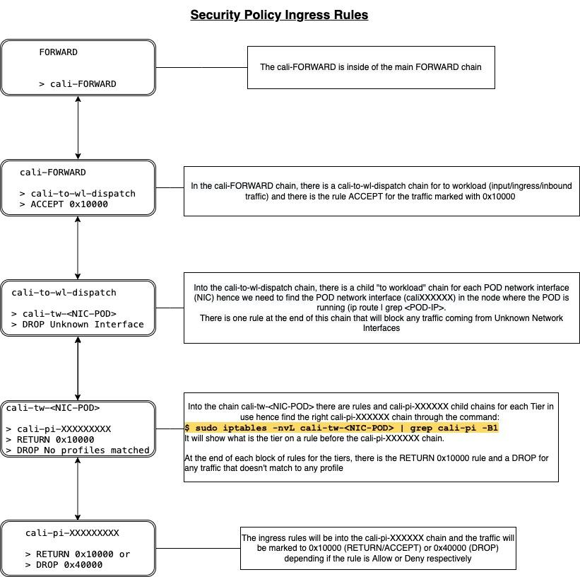
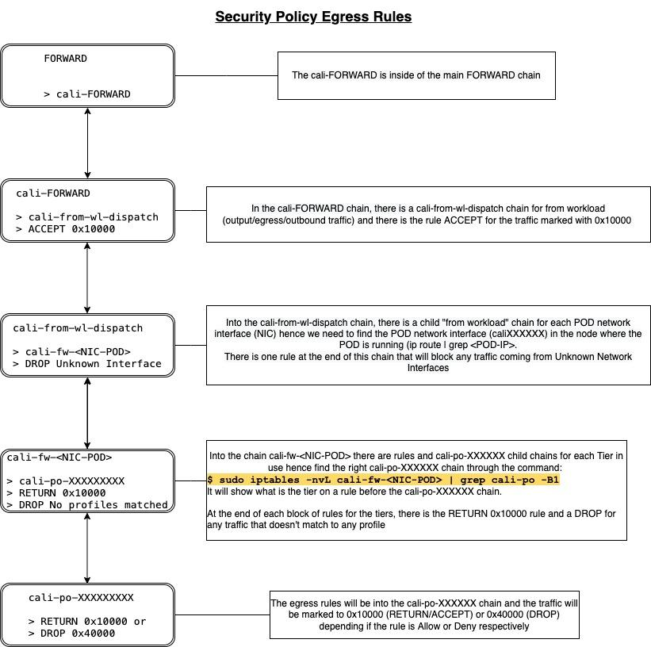
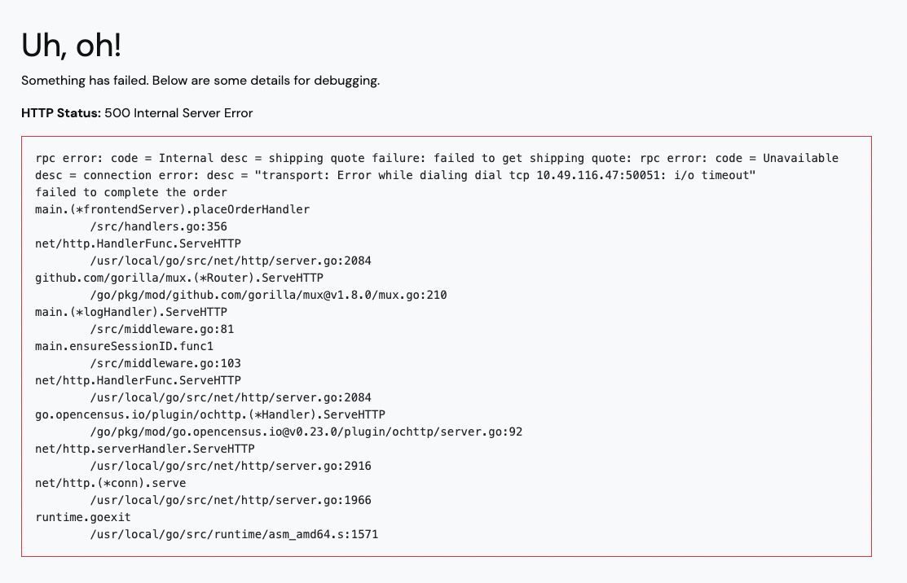

# Module 3 - Investigate denied flows using CLI

## 1. How to track the iptables rule from a Security Policy

### Demo

#### a. We are going to track down the checkoutservice Security Policy rules on iptables.

#### b. Verify in which node the checkoutservice pod is running:

```bash
kubectl get pods -l app=checkoutservice  -n hipstershop -o wide
```
```bash
NAME                               READY   STATUS    RESTARTS       AGE   IP              NODE                                         NOMINATED NODE   READINESS GATES
checkoutservice-598d5b586d-wsvmz   1/1     Running   66 (97m ago)   18d   10.48.127.224   ip-10-0-1-30.ca-central-1.compute.internal   <none>           <none>
```

#### c. Login on the node through SSH. In this case it is node ip-10-0-1-30.ca-central-1.compute.internal so the command would be:

```bash
ssh worker1
```

#### d. Check in iptables the cali-pi (input) and cali-po (output) chains:

```bash
sudo iptables-save  | grep checkout | grep cali-p[o,i] | grep -v nflog
```
```bash
-A cali-pi-_sQdl6e7ekf9DS2UYNem -p tcp -m comment --comment "cali:fwIMoHrbCWNN0i6y" -m comment --comment "Policy hipstershop/app-hipstershop.checkoutservice ingress" -m set --match-set cali40s:_DJYf5MR3V3B4fL2YDPlFn7 src -m multiport --dports 5050 -j MARK --set-xmark 0x10000/0x10000
-A cali-po-_sQdl6e7ekf9DS2UYNem -m comment --comment "cali:NrlO0UOCu-NgEXYU" -m comment --comment "Policy hipstershop/app-hipstershop.checkoutservice egress" -j MARK --set-xmark 0x0/0x180000
```

cali-pi-XXXXX > chain for input/inbound rules (ingress)
cali-po-XXXXX > chain for output/outbound rules (egress)

#### e. Check in iptables the cali-pi (input) chain, we can see the first rule to TCP/5050 marked to 0x10000 and the last rule it is returning to the previous chain the packets with mark 0x10000.

```bash
sudo iptables -nvL cali-pi-_sQdl6e7ekf9DS2UYNem
```
```bash
Chain cali-pi-_sQdl6e7ekf9DS2UYNem (1 references)
 pkts bytes target     prot opt in     out     source               destination         
    1    60 MARK       tcp  --  *      *       0.0.0.0/0            0.0.0.0/0            /* cali:fwIMoHrbCWNN0i6y */ /* Policy hipstershop/app-hipstershop.checkoutservice ingress */ match-set nncali40s:_DJYf5MR3V3B4fL2YDPlFn7 src multiport dports 5050 MARK or 0x10000
    1    60 NFLOG      all  --  *      *       0.0.0.0/0            0.0.0.0/0            /* cali:jtt9uTELeZiK6HTc */ mark match 0x10000/0x10000 nflog-prefix  "API0|hipstershop/app-hipstershop.checkoutservice" nflog-group 1 nflog-size 80
    1    60 RETURN     all  --  *      *       0.0.0.0/0            0.0.0.0/0            /* cali:49i8yZ9WeeBJcJFx */ mark match 0x10000/0x10000
```

#### f. The traffic marked with 0x10000 will be returned to the previous chains until reaching the chain cali-FORWARD and when we list the cali-FORWARD rules, the rule with the comment “Policy explicitly accepted packet” is accepting all packets marked with 0x10000 hence, this traffic is allowed.

```bash
$ sudo iptables -nvL cali-FORWARD
```
```bash
Chain cali-FORWARD (1 references)
 pkts bytes target     prot opt in     out     source               destination         
6114K 1083M NFLOG      udp  --  *      cali+   0.0.0.0/0            0.0.0.0/0            /* cali:M398jh6z4KAudBHO */ ctstate ESTABLISHED ctorigdstport 53 ctorigdst 10.49.0.10 nflog-prefix  DNS nflog-group 3 nflog-size 1024
6114K 1083M NFLOG      udp  --  *      cali+   0.0.0.0/0            0.0.0.0/0            /* cali:Y0ublHUopU6Z5cTD */ ctstate ESTABLISHED ctorigdstport 53 ctorigdst 10.49.0.10 nflog-prefix  DNS nflog-group 3 nflog-size 1024
    0     0 NFLOG      udp  --  *      cali+   0.0.0.0/0            0.0.0.0/0            /* cali:CMrdUPzr6ZBH-Fc2 */ ctstate ESTABLISHED ctorigdstport 53 ctorigdst 10.0.0.2 nflog-prefix  DNS nflog-group 3 nflog-size 1024
5694K  564M NFLOG      udp  --  cali+  *       0.0.0.0/0            0.0.0.0/0            /* cali:8ifjUVKTn1dXEp-r */ ctstate NEW ctorigdstport 53 ctorigdst 10.49.0.10 nflog-prefix  DNS nflog-group 3 nflog-size 1024
5694K  564M NFLOG      udp  --  cali+  *       0.0.0.0/0            0.0.0.0/0            /* cali:Xr4GlKIa-LDbIRg- */ ctstate NEW ctorigdstport 53 ctorigdst 10.49.0.10 nflog-prefix  DNS nflog-group 3 nflog-size 1024
    0     0 NFLOG      udp  --  cali+  *       0.0.0.0/0            0.0.0.0/0            /* cali:hriZM2GuaOc-jiJT */ ctstate NEW ctorigdstport 53 ctorigdst 10.0.0.2 nflog-prefix  DNS nflog-group 3 nflog-size 1024
 415M   97G MARK       all  --  *      *       0.0.0.0/0            0.0.0.0/0            /* cali:n_AfHpxjBIfRlCUE */ MARK and 0xffc5ffff
 415M   97G cali-from-hep-forward  all  --  *      *       0.0.0.0/0            0.0.0.0/0            /* cali:N1ZUoOipTUqxYp4j */ mark match 0x0/0x10000
7751K  710M cali-from-wl-dispatch  all  --  cali+  *       0.0.0.0/0            0.0.0.0/0            /* cali:nxYkktP8fafPqIg_ */
2345K  147M cali-to-wl-dispatch  all  --  *      cali+   0.0.0.0/0            0.0.0.0/0            /* cali:KQs0yIM9YcZ9wY0u */
8320K  722M cali-to-hep-forward  all  --  *      *       0.0.0.0/0            0.0.0.0/0            /* cali:8AipZb0bB3Xm7Ken */
8320K  722M cali-cidr-block  all  --  *      *       0.0.0.0/0            0.0.0.0/0            /* cali:lVvjuxobYEAxjV5D */
8320K  722M ACCEPT     all  --  *      *       0.0.0.0/0            0.0.0.0/0            /* cali:oDPPXeWnTTgDrXjp */ /* Policy explicitly accepted packet. */ mark match 0x10000/0x10000
    0     0 MARK       all  --  *      *       0.0.0.0/0            0.0.0.0/0            /* cali:RhxWn9tXI1t4BaJg */ MARK or 0x10000
```

#### g. Check in iptables the cali-po (output) chain, returned from step “d”, we can see each rule from the egress Security Policy and it is also marked with 0x10000. After each mark, there is a RETURN rule for mark 0x10000 hence it will be returned to the previous chains until reaching the chain (cali-FORWARD) and will be allowed from the same rule as we showed above.

```bash
sudo iptables -nvL cali-po-_sQdl6e7ekf9DS2UYNem | egrep 'multiport|RETURN'
```
```bash
    0     0 MARK       tcp  --  *      *       0.0.0.0/0            0.0.0.0/0            /* cali:z0YCrxgn5KdJMzaY */ multiport dports 7070 mark match 0x80000/0x80000 MARK or 0x10000
    0     0 RETURN     all  --  *      *       0.0.0.0/0            0.0.0.0/0            /* cali:ReAs2LI2rMw4arIm */ mark match 0x10000/0x10000
    0     0 MARK       tcp  --  *      *       0.0.0.0/0            0.0.0.0/0            /* cali:Sif45SsQ2CyimuzW */ multiport dports 8080 mark match 0x80000/0x80000 MARK or 0x10000
    0     0 RETURN     all  --  *      *       0.0.0.0/0            0.0.0.0/0            /* cali:FSi1rqqyk8EzAG9g */ mark match 0x10000/0x10000
    0     0 MARK       tcp  --  *      *       0.0.0.0/0            0.0.0.0/0            /* cali:FPO1600v3_ymKPvA */ multiport dports 50051 mark match 0x80000/0x80000 MARK or 0x10000
    0     0 RETURN     all  --  *      *       0.0.0.0/0            0.0.0.0/0            /* cali:2uY8pBoUFrB57t5c */ mark match 0x10000/0x10000
    0     0 MARK       tcp  --  *      *       0.0.0.0/0            0.0.0.0/0            /* cali:1dQCkNtvK0juGugU */ multiport dports 3550 mark match 0x80000/0x80000 MARK or 0x10000
    0     0 RETURN     all  --  *      *       0.0.0.0/0            0.0.0.0/0            /* cali:zeNtGdRwuGRinzdl */ mark match 0x10000/0x10000
    0     0 MARK       tcp  --  *      *       0.0.0.0/0            0.0.0.0/0            /* cali:MNVVmfgkm1FOnefG */ multiport dports 50051 mark match 0x80000/0x80000 MARK or 0x10000
    0     0 RETURN     all  --  *      *       0.0.0.0/0            0.0.0.0/0            /* cali:M3HvFiZhX-cfL5D- */ mark match 0x10000/0x10000
    0     0 MARK       tcp  --  *      *       0.0.0.0/0            0.0.0.0/0            /* cali:wwYIygv78L9vTmpM */ multiport dports 7000 mark match 0x80000/0x80000 MARK or 0x10000
    0     0 RETURN     all  --  *      *       0.0.0.0/0            0.0.0.0/0            /* cali:wVcE_67Yk6DizRI0 */ mark match 0x10000/0x10000
```

#### h. Now, let's change the checkoutservice Security Policy ingress rule to “deny". For that, open a new session for the bastion node, run the script below and type the option “7” (Demo Change Ingress Rule to Deny Track iptables rules) and press “Enter”

```bash
/home/tigera/tsworkshop/workshop1/lab-script.sh
```

#### i. Get back on the worker node terminal and run the iptables command again on the cali-pi-XXX chain.

If we track down this rule, we can see that the traffic was marked as 0x40000 and the last rule is dropping this traffic.

```bash
$ sudo iptables -nvL cali-pi-_sQdl6e7ekf9DS2UYNem
```
```bash
Chain cali-pi-_sQdl6e7ekf9DS2UYNem (1 references)
 pkts bytes target     prot opt in     out     source               destination         
    0     0 MARK       tcp  --  *      *       0.0.0.0/0            0.0.0.0/0            /* cali:g4_2VFU0HlDzmg6t */ /* Policy hipstershop/app-hipstershop.checkoutservice ingress */ match-set cali40s:_DJYf5MR3V3B4fL2YDPlFn7 src multiport dports 5050 MARK or 0x40000
    0     0 NFQUEUE    all  --  *      *       0.0.0.0/0            0.0.0.0/0            /* cali:0AUyjrsP_LEvZJla */ mark match 0x200000/0x200000 mark match ! 0x400000/0x400000 mark match 0x40000/0x40000 NFQUEUE num 100
    0     0 NFLOG      all  --  *      *       0.0.0.0/0            0.0.0.0/0            /* cali:dBRq4pgnpcbIpwoH */ mark match 0x40000/0x40000 nflog-prefix  "DPI0|hipstershop/app-hipstershop.checkoutservice" nflog-group 1 nflog-size 80
    0     0 DROP       all  --  *      *       0.0.0.0/0            0.0.0.0/0            /* cali:RFn2XJDp5NZuj-Kc */ mark match 0x40000/0x40000
```

#### j. Log out of the worker node by typing exit

#### k. To revert the checkoutservice Security Policy ingress rule to allow, go back to the the script on bastion node and type the option “71” (Demo Revert to Allow Track iptables rules) and press “Enter”


The diagrams below shows the chain’s flow for the Ingress and Egress Rules to/from a POD:


<p align="center">
  
</p>

<p align="center">
  
</p>


### LAB

Following the same instructions provided in the Demo, track down the cartservice Security Policy rules on iptables.


## 2. How to identify denied flows through the logs

### Demo

#### a.In the lab, run a multitool pod in the default namespace:

```bash
kubectl run multitool --image=wbitt/network-multitool
```

#### b. Exec into the console/bash of the multitool pod:

```bash
kubectl exec -it multitool -- bash
```

#### c. Run a curl into frontend HTTP service in the hipstershop namespace. The connection should be established as the frontend Ingress Rule (fronted Security Policy) accepts connection on port 8080 from any source:

```bash
$ curl http://frontend.hipstershop.svc.cluster.local
```

#### d. Run the loop below into the checkoutservice service port 5050 and it should time out after 5 seconds. It is expected as the Security Policy checkoutservice only allows ingress traffic coming from the frontend and the other ones should be denied. Leave the loop running and open a new terminal to use for the next steps:

```bash
while true; do curl http://checkoutservice.hipstershop.svc.cluster.local:5050 --connect-timeout 5; sleep 10; done
```

#### e. As the Security Policy has been enforced on checkoutservice pod, let’s check on which node this pod is running:

```bash
kubectl get pod -n hipstershop -o wide -l app=checkoutservice
```
```bash
NAME                               READY   STATUS    RESTARTS       AGE   IP              NODE                                         NOMINATED NODE   READINESS GATES
checkoutservice-598d5b586d-wsvmz   1/1     Running   82 (85m ago)   20d   10.48.127.224   ip-10-0-1-30.ca-central-1.compute.internal   <none>           <none>
```

#### f. Login on the node where the checkoutservice pod is running. In this case it is node ip-10-0-1-30.ca-central-1.compute.internal so the command would be:

```bash
ssh worker1
```

#### g. Run the command below to grep for the denied flows from the multitool pod:

```bash
$ grep multitool /var/log/calico/flowlogs/flows.log | grep -i deny
```
```bash
{"start_time":1659621542,"end_time":1659621842,"source_ip":"10.48.116.157","source_name":"multitool","source_name_aggr":"multitool","source_namespace":"default","nat_outgoing_ports":null,"source_port":null,"source_type":"wep","source_labels":{"labels":["run=multitool"]},"dest_ip":"10.48.127.224","dest_name":"checkoutservice-598d5b586d-wsvmz","dest_name_aggr":"checkoutservice-598d5b586d-*","dest_namespace":"hipstershop","dest_port":5050,"dest_type":"wep","dest_labels":{"labels":["app=checkoutservice","pod-template-hash=598d5b586d","tenant=hipstershop"]},"dest_service_namespace":"-","dest_service_name":"-","dest_service_port":"-","dest_service_port_num":null,"proto":"tcp","action":"deny","reporter":"dst","policies":{"all_policies":["1|app-hipstershop|hipstershop/app-hipstershop.checkoutservice|deny|-1","0|security|security.tenant-histershop|pass|0"]},"bytes_in":300,"bytes_out":0,"num_flows":1,"num_flows_started":1,"num_flows_completed":1,"packets_in":5,"packets_out":0,"http_requests_allowed_in":0,"http_requests_denied_in":0,"process_name":"-","num_process_names":0,"process_id":"-","num_process_ids":0,"process_args":["-"],"num_process_args":0,"original_source_ips":null,"num_original_source_ips":0,"tcp_mean_send_congestion_window":0,"tcp_min_send_congestion_window":0,"tcp_mean_smooth_rtt":0,"tcp_max_smooth_rtt":0,"tcp_mean_min_rtt":0,"tcp_max_min_rtt":0,"tcp_mean_mss":0,"tcp_min_mss":0,"tcp_total_retransmissions":0,"tcp_lost_packets":0,"tcp_unrecovered_to":0}
```

From the flow entry above, we can see:

```nano
“source_ip":"10.48.116.157
“source_name":"multitool"
“source_namespace":"default"
“dest_ip":"10.48.127.224"
"dest_name":"checkoutservice-598d5b586d-wsvmz"
"dest_port":5050
"action":"deny"
"policies":{"all_policies":["1|app-hipstershop|hipstershop/app-hipstershop.checkoutservice|deny|-1","0|security|security.tenant-histershop|pass|0"]}
```

Therefore, the Security Policy app-hipstershop.checkoutservice has denied this flow as the ingress rule only accepts connections from the frontend pod.
	
The flow logs are difficult to read but you can parse them in json format with “jq” as per the output below:

```bash
grep multitool /var/log/calico/flowlogs/flows.log | grep -i deny -m 1 | jq
```
```bash
{
  "start_time": 1659621542,
  "end_time": 1659621842,
  "source_ip": "10.48.116.157",
  "source_name": "multitool",
  "source_name_aggr": "multitool",
  "source_namespace": "default",
  "nat_outgoing_ports": null,
  "source_port": null,
  "source_type": "wep",
  "source_labels": {
    "labels": [
      "run=multitool"
    ]
  },
  "dest_ip": "10.48.127.224",
  "dest_name": "checkoutservice-598d5b586d-wsvmz",
  "dest_name_aggr": "checkoutservice-598d5b586d-*",
  "dest_namespace": "hipstershop",
  "dest_port": 5050,
  "dest_type": "wep",
  "dest_labels": {
    "labels": [
      "app=checkoutservice",
      "pod-template-hash=598d5b586d",
      "tenant=hipstershop"
    ]
  },
  "dest_service_namespace": "-",
  "dest_service_name": "-",
  "dest_service_port": "-",
  "dest_service_port_num": null,
  "proto": "tcp",
  "action": "deny",
  "reporter": "dst",
  "policies": {
    "all_policies": [
      "1|app-hipstershop|hipstershop/app-hipstershop.checkoutservice|deny|-1",
      "0|security|security.tenant-histershop|pass|0"
    ]
  },
  "bytes_in": 300,
  "bytes_out": 0,
  "num_flows": 1,
  "num_flows_started": 1,
  "num_flows_completed": 1,
  "packets_in": 5,
  "packets_out": 0,
  "http_requests_allowed_in": 0,
  "http_requests_denied_in": 0,
  "process_name": "-",
  "num_process_names": 0,
  "process_id": "-",
  "num_process_ids": 0,
  "process_args": [
    "-"
  ],
  "num_process_args": 0,
  "original_source_ips": null,
  "num_original_source_ips": 0,
  "tcp_mean_send_congestion_window": 0,
  "tcp_min_send_congestion_window": 0,
  "tcp_mean_smooth_rtt": 0,
  "tcp_max_smooth_rtt": 0,
  "tcp_mean_min_rtt": 0,
  "tcp_max_min_rtt": 0,
  "tcp_mean_mss": 0,
  "tcp_min_mss": 0,
  "tcp_total_retransmissions": 0,
  "tcp_lost_packets": 0,
  "tcp_unrecovered_to": 0
}
```

#### h. Alternatively, if you don’t have access to the node console/ssh, for example in an AKS/EKS/GKE, you can find which calico-node pod is related to the node as per the command below:

```bash
kubectl get po -n calico-system -o wide | grep calico-node
```
```bash
calico-node-7f7gf                          1/1     Running   0          20d   10.0.1.30      ip-10-0-1-30.ca-central-1.compute.internal   <none>           <none>
calico-node-925kb                          1/1     Running   0          20d   10.0.1.31      ip-10-0-1-31.ca-central-1.compute.internal   <none>           <none>
calico-node-f6bbj                          1/1     Running   0          20d   10.0.1.20      ip-10-0-1-20.ca-central-1.compute.internal   <none>           <none>
```

#### i. The calico-node calico-node-7f7gf is related to the node ip-10-0-1-30.ca-central-1.compute.internal so let’s execute into its console:

```bash
kubectl exec -it calico-node-7f7gf -n calico-system -- bash
```

#### j. Running the same grep command than in step “g” will show the same flow(s) as below:

```bash
grep multitool /var/log/calico/flowlogs/flows.log | grep -i deny
```
```bash
{"start_time":1659621542,"end_time":1659621842,"source_ip":"10.48.116.157","source_name":"multitool","source_name_aggr":"multitool","source_namespace":"default","nat_outgoing_ports":null,"source_port":null,"source_type":"wep","source_labels":{"labels":["run=multitool"]},"dest_ip":"10.48.127.224","dest_name":"checkoutservice-598d5b586d-wsvmz","dest_name_aggr":"checkoutservice-598d5b586d-*","dest_namespace":"hipstershop","dest_port":5050,"dest_type":"wep","dest_labels":{"labels":["app=checkoutservice","pod-template-hash=598d5b586d","tenant=hipstershop"]},"dest_service_namespace":"-","dest_service_name":"-","dest_service_port":"-","dest_service_port_num":null,"proto":"tcp","action":"deny","reporter":"dst","policies":{"all_policies":["1|app-hipstershop|hipstershop/app-hipstershop.checkoutservice|deny|-1","0|security|security.tenant-histershop|pass|0"]},"bytes_in":300,"bytes_out":0,"num_flows":1,"num_flows_started":1,"num_flows_completed":1,"packets_in":5,"packets_out":0,"http_requests_allowed_in":0,"http_requests_denied_in":0,"process_name":"-","num_process_names":0,"process_id":"-","num_process_ids":0,"process_args":["-"],"num_process_args":0,"original_source_ips":null,"num_original_source_ips":0,"tcp_mean_send_congestion_window":0,"tcp_min_send_congestion_window":0,"tcp_mean_smooth_rtt":0,"tcp_max_smooth_rtt":0,"tcp_mean_min_rtt":0,"tcp_max_min_rtt":0,"tcp_mean_mss":0,"tcp_min_mss":0,"tcp_total_retransmissions":0,"tcp_lost_packets":0,"tcp_unrecovered_to":0}
```

#### k. Press CTRL+C on the multitool pod loop then exit to finish the bash shell. Type exit on the calico-node shell to finish the bash. Type exit to return to the bastion node.

#### l. Delete the multitool pod:
```bash
kubectl delete pod multitool
```

### LAB

#### a. Open the lab and run the script below:

```bash
/home/tigera/tsworkshop/workshop1/lab-script.sh
```

#### b. Type the option “8” (LAB Break Online Boutique - Flow Logs) and press “Enter”

#### c. Type "99" and press “Enter” to exit the script

#### d. Open the browser with the URL shown through the command below:

```bash
echo https://hipstershop.$(kubectl cluster-info | grep -i control | awk -F "://" '{print $2}' | cut -d. -f1).lynx.tigera.ca
```

#### e. Select any product(s), add to the Cart and click on “Place Order”.

#### f. An internal server error will return saying “failed to get shipping quote: rpc error”

```nano
HTTP Status: 500 Internal Server Error

rpc error: code = Internal desc = shipping quote failure: failed to get shipping quote: rpc error: code = Unavailable desc = connection error: desc = "transport: Error while dialing dial tcp 10.49.116.47:50051: i/o timeout"
failed to complete the order
```

<p align="center">
  
</p>

#### g. Investigate through the Flow logs which flows have been denied and the Security Policy related to it, and how to fix this issue. Use the hipstershop application information provided in **[Module 1 - Topic 4](https://github.com/tigera-cs/observability-clinic/blob/main/1.%20Overview/readme.md#4-install-hipstershop-application)**.

#### h. To revert back the misconfiguration applied, run the script and type “81” (LAB Fix Online Boutique - Flow Logs) and press Enter. To exit type "99" and press “Enter”.

## 3. How to identify denied flows on linux non-k8s node

### Demo

#### a. Login to bastion node and run the loop below:

```bash
$ while true; do curl https://kubernetes.io --connect-timeout 5; sleep 10; done
```
```bash
curl: (28) Connection timed out after 5001 milliseconds
```

#### b. As expected behavior, the connection will time out because the hep-external Security Policy only allows egress HTTPS to *\*.google.com* and *\*.tigera.com*. 

#### c. Leave the loop running for around 5 cycles and press CTRL+C to cancel it.

#### d. Grep on syslog for “deny”, source IP 10.0.1.10 (bastion IP) and destination port HTTPS (TCP 443) we find denied flows to the IP 147.75.40.148.

```bash
sudo grep deny /var/log/syslog | grep "srcIP=\"10.0.1.10\"" | grep "dstPort=\"443\""
```
```bash
Aug  4 16:14:12 bastion calico-felix[312412]: INFO <nil> <nil>:  action="deny" dstIP="147.75.40.148" dstPort="443" inBytes=0 inPackets=0 outBytes=120 outPackets=2 policy="hep-external" proto="6" rule="-1" ruleDir="egress" srcIP="10.0.1.10" srcPort="57312" tier="security" trafficDir="outbound" updateType=report
Aug  4 16:14:17 bastion calico-felix[312412]: INFO <nil> <nil>:  action="deny" dstIP="147.75.40.148" dstPort="443" inBytes=0 inPackets=0 outBytes=120 outPackets=2 policy="hep-external" proto="6" rule="-1" ruleDir="egress" srcIP="10.0.1.10" srcPort="57314" tier="security" trafficDir="outbound" updateType=report
Aug  4 16:14:21 bastion calico-felix[312412]: INFO <nil> <nil>:  action="deny" dstIP="147.75.40.148" dstPort="443" inBytes=0 inPackets=0 outBytes=180 outPackets=3 policy="hep-external" proto="6" rule="-1" ruleDir="egress" srcIP="10.0.1.10" srcPort="57316" tier="security" trafficDir="outbound" updateType=report
Aug  4 16:14:26 bastion calico-felix[312412]: INFO <nil> <nil>:  action="deny" dstIP="147.75.40.148" dstPort="443" inBytes=0 inPackets=0 outBytes=180 outPackets=3 policy="hep-external" proto="6" rule="-1" ruleDir="egress" srcIP="10.0.1.10" srcPort="57320" tier="security" trafficDir="outbound" updateType=report
```

#### e. As the IP 147.75.40.148 doesn’t respond to the DNS reverse, let’s do a nslookup on the kubernetes.io and we will find the IP from the denied flows:

```bash
nslookup www.kubernetes.io
```
```bash
Server:		127.0.0.53
Address:	127.0.0.53#53

Non-authoritative answer:
www.kubernetes.io	canonical name = kubernetes.io.
Name:	kubernetes.io
Address: 147.75.40.148
```

#### f. Therefore, we can find the flows for non-k8s linux nodes in /var/log/syslog log. 

### LAB

#### a. Open the lab and run the script below:
```bash
/home/tigera/tsworkshop/workshop1/lab-script.sh
```

#### b. Type the option “9” (LAB Break HEP non-k8s) and press “Enter”

#### c. Type "99" and press “Enter” to exit the script

#### d. Run the command below to list the directory /etc on the control1 node:

```bash
ssh -o ConnectTimeout=5 control1 ls /etc
```

It should return the list of files inside of /etc.

#### e. Try now to list the files into /etc on the worker1 node. It will return times out:

```bash
ssh -o ConnectTimeout=5 worker1 ls /etc
```
```bash
ssh: connect to host ip-10-0-1-30.ca-central-1.compute.internal port 22: Connection timed out
```

#### f. Investigate through the syslog to verify which flows have been denied and the Security Policy related to it, and how to fix this issue. Remember that the SSH (TCP 22) has been configured in the FAILSAFE OUTBOUND in **[Module 1 - Topic 5](https://github.com/tigera-cs/observability-clinic/blob/main/1.%20Overview/readme.md#h-configure-the-calico-service-in-the-bastion-host)**.

#### g. To revert back the misconfiguration applied, run the script and type “91” (LAB Fix HEP non-k8s) and press Enter. To exit type "99" and press “Enter”.
